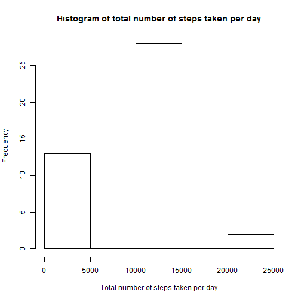
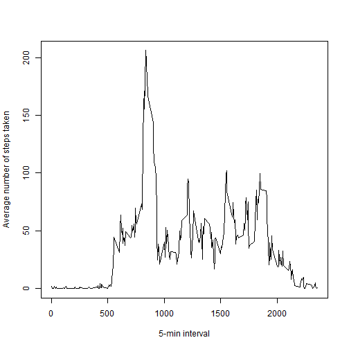
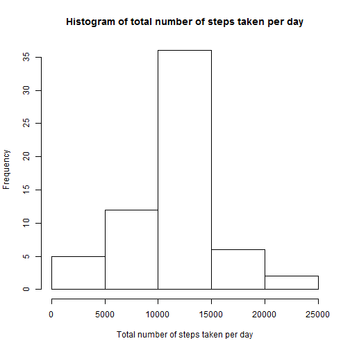

# Reproducible Research: Peer Assessment 1


## Loading and preprocessing the data

Unzip the dataset.

```r
if (file.exists("./activity.zip")){
        unzip("./activity.zip")        
}
```

Read the csv file into R.   

```r
library(data.table)
file <- "./activity.csv"
myData <- read.csv(file)
```

Convert date column from character to "Date" class. Convert myData from data frame to data table.

```r
myData$date <- as.Date(myData$date)
myData <- data.table(myData)
```

## What is mean total number of steps taken per day?

Sum over the steps by date. Plot the histogram.

```r
Total <- myData[,sum(steps, na.rm = TRUE), by = date]
hist(Total$V1, xlab = "Total number of steps taken per day", main = "Histogram of total number of steps taken per day")
```

 

Calculate the mean and median total number of steps taken per day.

```r
mean(Total$V1)
```

```
## [1] 9354
```

```r
median(Total$V1)
```

```
## [1] 10395
```

## What is the average daily activity pattern?

Calculate the mean by interval, plot the time series of the average number of steps 

```r
Average <- myData[,mean(steps, na.rm = TRUE), by = interval]
plot(Average$interval, Average$V1, type = "l", xlab = "5-min interval", ylab = "Average number of steps taken")
```

 

Find the index of the max value and the corresponding 5-minute interval.

```r
index <- which.max(Average$V1)
Average$interval[[index]]
```

```
## [1] 835
```

## Imputing missing values

Count missing values in the steps column.

```r
sum(is.na(myData$steps))
```

```
## [1] 2304
```

First create a new dataset newData. Then fill the missing values with the mean steps for the 5-min interval.

```r
newData <- copy(myData)
naindex <- which(is.na(newData$steps))  # find the location of NA
intervals <- newData$interval[naindex]  # find the corresponding 5-min interval
Averageindex <- match(intervals,Average$interval)  # find the mean steps for the 5-min interval
newData$steps[naindex] <- Average$V1[Averageindex]  # substitute NA with the mean steps
newTotal <- newData[,sum(steps), by = date]  # Sum over the steps by date
```

Make a histogram of the total number of steps taken each day and Calculate and report the mean and median total number of steps taken per day. 

```r
hist(newTotal$V1, xlab = "Total number of steps taken per day", main = "Histogram of total number of steps taken per day")
```

 

```r
mean(newTotal$V1)
```

```
## [1] 10766
```

```r
median(newTotal$V1)
```

```
## [1] 10766
```
Both mean and median increase from the first part of assignment. 

The impact of imputing missing data on the estimates of the total daily number of steps is a higher peak between 10000 and 15000 on the histogram due to the filling strategy of the mean for the 5-minute interval.

## Are there differences in activity patterns between weekdays and weekends?

Make a new factor vairable with two levels "weekday" and "weekend". 
Subsetting dataset newData into weekdayData and weekendData.
Then calculate the mean steps by interval.

```r
newData$isweekday <- ifelse(!(weekdays(as.Date(newData$date)) %in% c('Saturday','Sunday')), 'weekday', 'weekend')
weekdayData <- newData[which(newData$isweekday == 'weekday'),]
weekendData <- newData[which(newData$isweekday == 'weekend'),]
weekdayAverage <- weekdayData[,mean(steps), by = interval]
weekendAverage <- weekendData[,mean(steps), by = interval]
```

Make a panel plot containing a time series plot of the 5-minute interval (x-axis) and the average number of steps taken, averaged across all weekday days or weekend days (y-axis).

```r
library(lattice)
xyplot(V1~interval|which, make.groups(weekday=weekdayAverage, weekend=weekendAverage), type = "l", layout = c(1,2), ylab = "Number of steps" )
```

 
